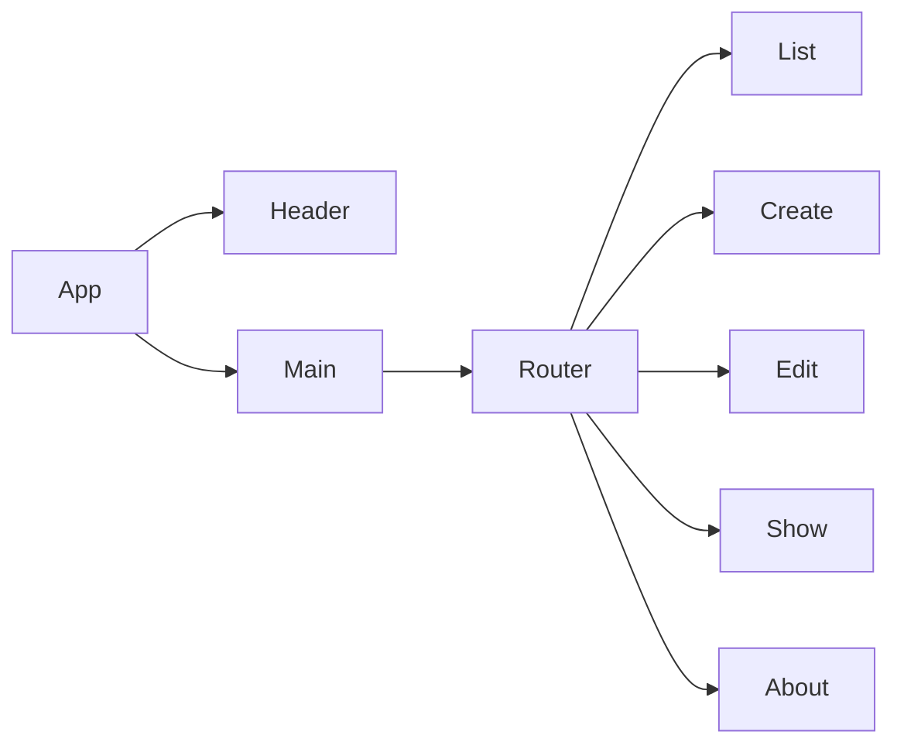

## Product Documentation

**Summary**
| Field | Detail |
|-------|--------|
| Project Name | Pwnterest |
| Description | To bodly share what has, never been shared before. |
| Developers | Rich Clarke, Isiah Yates, Hieu Nguyen, Kyle Canamar |
| Live Website | [Pwnterest](https://pwnterest.netlify.app/) |
| Backend Repo | [Repo](https://github.com/Isyates/pwnterest-project3-backend) |
| Technologies Used | MongoDb, Express, React, Node, Styled-Components, Font-Awesome|
| Miro Board | [Planning Board](https://miro.com/app/board/uXjVOvBb9KI=/?share_link_id=47759428068) |

## Target Market

This is a place to share images in a way that brings community together, aimed at young adults. We aim to have this platform share posts from all around the internet.

## User Stories

- Users should be able to see all items
- Users can create a new item
- Users can update items
- User can delete items

## Component Architecture

## User Interface Mockups

| Screenshots | Detail |
|-------|--------|
| | Landing Page |
|  | Create a post page |
|  | Display one post |
|  | Edit the chosen post |
|  | Learn more about the devs on their socials |

## Coming Soon

- Authentication
- Masonry Styled
- Community Features