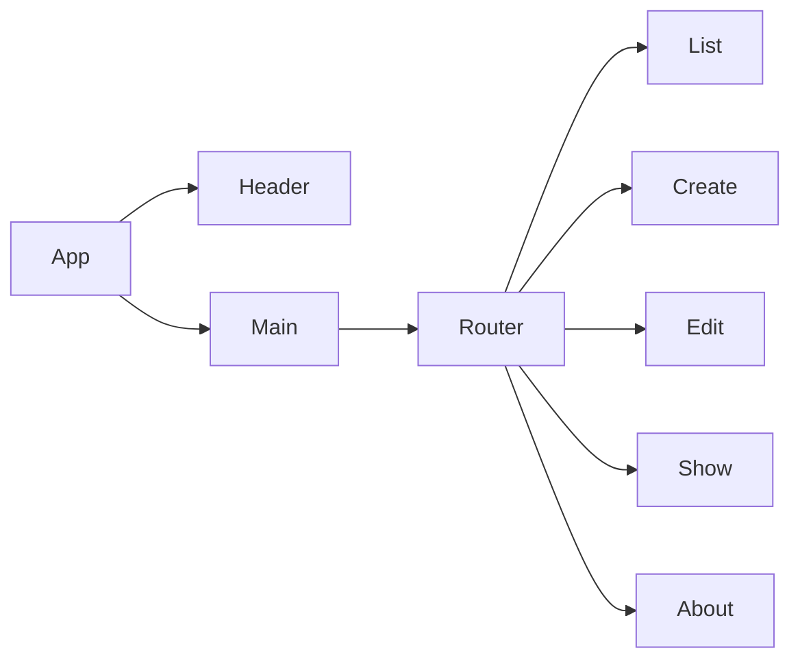

## Product Documentation

**Summary**
| Field | Detail |
|-------|--------|
| Project Name | Pwnterest |
| Description | To bodly share what has, never been shared before. |
| Developers | Rich Clarke, Isiah Yates, Hieu Nguyen, Kyle Canamar |
| Live Website | https://pwnterest.netlify.app/ |
| Backend Repo | https://github.com/Isyates/pwnterest-project3-backend |

## Target Market

Use this area to explain what problem your app is solving, and who are the people who have this problem.

## User Stories

- Users should be able to see all items
- Users can create a new item
- Users can update items
- User can delete items

## Component Architecture

## User Interface Mockups
